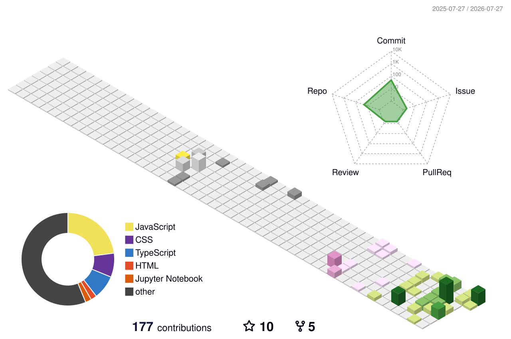

# Saranjan

<h1>Hi, I'm Pathmanesan Saranjan 👋</h1>
<h3> Aspiring UI/UX Designer Mobile & Web Developer </h3>

 

 

## 🛠️ Tech Stack

  

 

## 💼 Experience

  

 

<b>🟡Software Engineer — </b> &nbsp; 

 
<code>Node.js</code> <code>React</code> <code>OpenAI API</code> <code>AWS</code> <code>MongoDB</code>

<b>🔵 Full Stack Developer
 

Angular + NestJS/Node.js apps for *Travelapp*.

<code>Angular</code> <code>NestJS</code> <code>MySQL</code> <code>MongoDB</code>

<b>🔵 Aspiring Developer —</b> &nbsp; 

 

REST API integrations for *AT&T*.

<code>Angular</code> <code>Spring Boot</code>

**🎓 B.S.C IT Undergraduate** — 3rd Year IT Undergraduate at SLIIT 
**📜 Certified:** (Mobile & Web Developer) ·
 

## 🎨 Featured Projects

| | | |
|---|---|---|
| 🔺 **[laser-flow](https://github.com/Saranjan/laser-flow)** | Full-screen animated WebGL laser beam effect | `three.js` `React` |
| 🌀 **[image-trail](https://github.com/Saranjan/image-trail)** | Interactive image trail cursor effect | `React` `TypeScript` `GSAP` |
| 🖐️ **[AirDrawer](https://github.com/Saranjan/AirDrawer)** | Draw in the air using AI-powered hand tracking | `MediaPipe` `React` `Canvas` |
| ✋ **[Hand-Tracking](https://github.com/Saranjan/Hand-Tracking)** | Real-time webcam hand tracking with glitch visuals | `MediaPipe` `OpenCV` |
| 🪩 **[Holographic-Tilt-Login](https://github.com/Saranjan/Holographic-Tilt-Login)** | Holographic tilt-effect login card | `CSS` |
| 🚗 **[CarCounter](https://github.com/Saranjan/CarCounter)** | Drone-view vehicle counting & tracking | `OpenCV` `Python` |

 

## 📊 GitHub Analytics

<!--
github-readme-stats.vercel.app (stats card + top-langs below) is
currently returning HTTP 503 "DEPLOYMENT_PAUSED" — its free-tier
Vercel deployment hit a usage cap. This is a known recurring issue
with that public instance and it typically comes back on its own.
Uncomment the two lines below once https://github-readme-stats.vercel.app
loads normally again.

-->

 

 

## 🧊 3D Contribution Graph

 

## 🐍 Contribution Snake

<picture>
  <source media="(prefers-color-scheme: dark)" srcset="https://raw.githubusercontent.com/Saranjan/Saranjan-R03/output/github-contribution-grid-snake-dark.svg">
  <source media="(prefers-color-scheme: light)" srcset="https://raw.githubusercontent.com/Saranjan/Saranjan-R03/output/github-contribution-grid-snake.svg">
  
</picture>

<!--
Optional add-ons — uncomment once you have the account/token:

WakaTime weekly breakdown:

Spotify now playing (via spotify-github-profile by kittinan):

Holopin badges:

-->

 

📫 **Reach me:** [saranjanp1@gmail.com](mailto:saranjanp1@gmail.com) · [LinkedIn](https://linkedin.com/in/saran-jan-0481833)

 

name: Generate Snake

on:
  schedule:
    - cron: "0 0 * * *"   # daily at midnight UTC
  workflow_dispatch:
  push:
    branches: [ main ]

jobs:
  generate:
    permissions:
      contents: write
    runs-on: ubuntu-latest
    steps:
      - uses: Platane/snk@v3
        id: snake-gif
        with:
          github_user_name: Gowtham-R03
          outputs: |
            dist/github-contribution-grid-snake.svg
            dist/github-contribution-grid-snake-dark.svg?palette=github-dark
            dist/github-contribution-grid-snake.gif?color_snake=orange&color_dots=#bfd6f6,#8dbdff,#64a1f4,#4184e4,#2151ff

      - uses: crazy-max/ghaction-github-pages@v4
        with:
          target_branch: output
          build_dir: dist
        env:
          GITHUB_TOKEN: ${{ secrets.GITHUB_TOKEN }}
name: GitHub-Profile-3D-Contrib

on:
  schedule: # 03:00 JST == 18:00 UTC
    - cron: "0 18 * * *"
  workflow_dispatch:

permissions:
  contents: write

jobs:
  build:
    runs-on: ubuntu-latest
    name: generate-github-profile-3d-contrib
    steps:
      - uses: actions/checkout@v5
      - uses: yoshi389111/github-profile-3d-contrib@latest
        env:
          GITHUB_TOKEN: ${{ secrets.GITHUB_TOKEN }}
          USERNAME: ${{ github.repository_owner }}
      - name: Commit & Push
        run: |
          git config user.name github-actions
          git config user.email github-actions@github.com
          git add -A .
          if git commit -m "generated"; then
            git push
          fi

